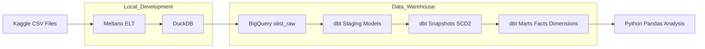

## Project Overview
This project builds an end-to-end analytics pipeline on the Olist Brazilian e-commerce dataset,
transforming raw CSV files into analytics-ready fact and dimension tables using dbt and BigQuery.

The goal is to analyse order growth, customer purchasing behaviour, and delivery performance
using production-style data modelling, testing, and validation.

## Data Source
- **Dataset:** Olist Brazilian E-commerce Dataset (Kaggle)
- **Period:** 2016–2018
- **Size:** ~100k orders, ~99k customers, ~33k products
- **Granularity:** Order-level transactional data
- 
## Architecture



### Data Modelling

Describe:
- Staging → Snapshots → Marts
- Facts vs Dimensions
- Why snapshots exist

Example:
```markdown
## Data Modelling

### Staging Layer
- One-to-one mappings from raw tables
- Type casting and standardised column names

### Snapshots
- SCD Type 2 tracking for:
  - Customers
  - Products
- Preserves historical attribute changes over time

### Marts
**Dimensions**
- dim_customers
- dim_products
- dim_sellers
- dim_geolocation

**Facts**
- fct_orders
- fct_order_items
- fct_payments
- fct_reviews

## Data Quality & Testing

dbt tests were implemented across staging and mart layers:
- Primary key uniqueness
- Not-null constraints
- Foreign key relationship tests between facts and dimensions

All tests pass successfully, ensuring referential integrity and analytical reliability.

## Analysis Highlights

- Monthly order volume grew steadily from 2016 to late 2017 before plateauing
- Over 90% of customers placed only one order, indicating low repeat purchase behaviour
- Median delivery time was ~10 days, with a long tail of delayed deliveries
- Late deliveries represented a small but significant minority of total orders

## Tech Stack
- **Data Ingestion:** Meltano
- **Data Warehouse:** BigQuery
- **Transformations:** dbt
- **Data Modelling:** Star schema (facts & dimensions)
- **Analysis:** Python, Pandas, Seaborn, Matplotlib
- **Version Control:** Git & GitHub
